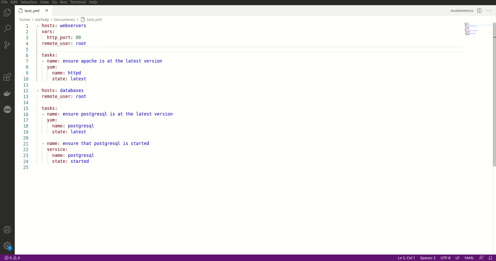

# AnsibleMetrics

This is the VSC extension of the Ansible metric tool (available on [Github](https://github.com/radon-h2020/radon-ansible-metrics/)).

## Features

**AnsibleMetrics** allows the user to have a wider overview of its infrastructure code by extracting metrics from it and by showing them in a very simple fashion.

The extension works only for Ansible playbooks and tasks files.


## How to use



## Requirements

The extension requires the python module ```ansiblemetrics>=0.3.3```.
You can install [the latest](https://pypi.org/project/ansiblemetrics/) version with 

```pip install ansiblemetrics```


## Release Notes

### 0.0.1
* Initial release

See the [CHANGELOG](CHANGELOG.md) for more information about the releases.
